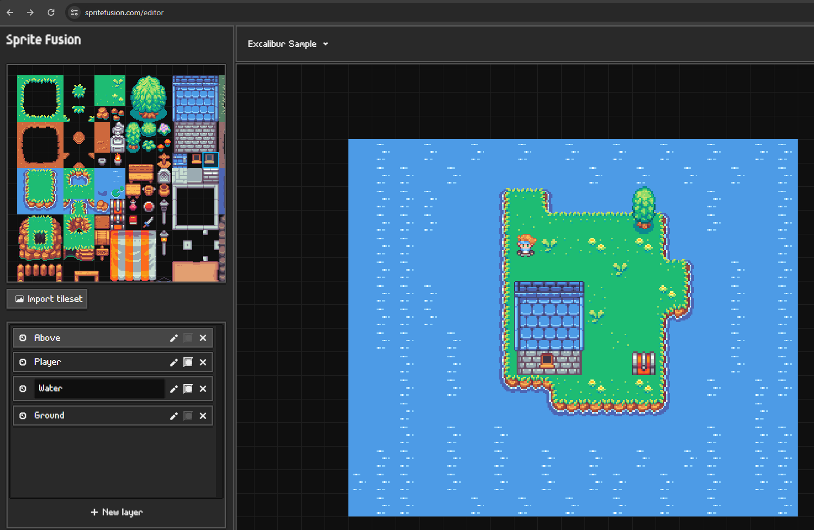

# Excalibur SpriteFusion Sample

Play sample [here](https://excaliburjs.com/sample-spritefusion)

Check out [SpriteFusion](https://www.spritefusion.com/editor)! And Export as JSON (`./map/` locally)

Upload the [project](./Excalibur%20Sample-SpriteFusion.json) to SpriteFusion and have fun!

Example running in excalibur

## Running locally

* Using [nodejs](https://nodejs.org/en/) and [npm](https://www.npmjs.com/)
* Run the `npm install` to install dependencies
* Run the `npm run start` to run the development server to test out changes

## Building bundles

* Run `npm run start` to produce javascript bundles for debugging in the `dist/` folder
* Run `npm run build` to produce javascript bundles for production (minified) in the `dist/` folder
